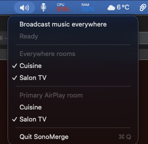

# SonoMerge

**TL;DR:** Broadcast your macOS audio to all your connected Sonos speakers in one click.

SonoMerge is a small macOS menu bar app and CLI for Sonos + AirPlay setups where macOS does not reliably keep multiple Sonos AirPlay rooms selected at the same time.

Instead of trying to force macOS to keep two separate AirPlay outputs checked, SonoMerge does this:

1. Switch the Mac audio output to one selected AirPlay-capable Sonos room.
2. Ask Sonos to group the other selected rooms into that room.

Example:

- Selected rooms: `Salon TV`, `Cuisine`
- Primary AirPlay room: `Salon TV`
- Result: Mac audio goes to `Salon TV`, and Sonos groups `Cuisine` into it

## Screenshot

<p align="center">
  
</p>

## Quick Usage

If you want the menu bar app:

```bash
./build-menu-bar-app.sh
open build/SonoMerge.app
```

Then:

1. Click the speaker icon in the top bar.
2. Check the rooms you want in `Everywhere rooms`.
3. Choose the `Primary AirPlay room`.
4. Click `Broadcast music everywhere`.

If you want the original fixed setup only:

```bash
./switch-sonos-airplay.command
```

That shortcut broadcasts to:

- `Salon TV`
- `Cuisine`

## How It Works

The menu bar app shows:

- `Broadcast music everywhere`
- `Everywhere rooms`
- `Primary AirPlay room`
- `Start at login`

When you click `Broadcast music everywhere`, SonoMerge:

1. Reads the checked Sonos rooms.
2. Uses the selected `Primary AirPlay room` as the Mac output target.
3. Switches macOS audio to that room.
4. Groups the other checked rooms into that Sonos room.

The checked rooms and the selected primary room are saved and reused on the next launch.

## Build

From the repo root:

```bash
./build-menu-bar-app.sh
```

This builds:

- `build/SonoMerge.app`
- `build/sonos_broadcast`

Launch the app with:

```bash
open build/SonoMerge.app
```

## CLI Usage

List visible Sonos rooms:

```bash
build/sonos_broadcast discover
```

Broadcast to a custom set of rooms:

```bash
build/sonos_broadcast broadcast --rooms "Salon TV" "Cuisine" --primary-room "Salon TV"
```

## Repo Layout

- `SonoMergeCore/`
  Shared native Swift Sonos and AirPlay logic
- `SonoMergeCLI/`
  Native Swift CLI source
- `SonoMergeMenuBarApp/`
  Native macOS menu bar app source
- `build-menu-bar-app.sh`
  Builds the app and native CLI
- `switch-sonos-airplay.command`
  Fixed shortcut for `Salon TV` + `Cuisine`

## Requirements

- macOS with Command Line Tools installed
- Sonos rooms reachable on the same local network as the Mac
- Accessibility permission for the app or terminal that starts the broadcast
- Apple Events / automation permission when macOS asks for it

There is no external `python3` runtime dependency anymore. The app and CLI are native Swift binaries.

## Permissions

SonoMerge changes the Mac output through the Sound item in Control Center. Because of that, macOS may ask for:

- Accessibility access
- Permission to control `System Events`

If the broadcast fails the first time, check:

- `System Settings -> Privacy & Security -> Accessibility`
- `System Settings -> Privacy & Security -> Automation`

## Notes About Room Selection

- The room list comes from live Sonos discovery, not from a hardcoded list.
- If a room is offline, it may not appear until it comes back on the network.
- The `Primary AirPlay room` must also be one of the checked rooms.

## Troubleshooting

If `Broadcast music everywhere` fails:

- Make sure the Sonos rooms are online and visible in the Sonos app.
- Make sure the Mac still sees the room as an AirPlay output in the Sound menu.
- Make sure the app has Accessibility and Automation permission.
- Re-open the menu and wait a second for the room list to refresh.
- Make sure the `Primary AirPlay room` is checked.

## Why This Exists

This project does not try to force macOS to keep two independent AirPlay room checkboxes selected at the same time.

It uses the path that worked reliably in testing:

- one explicit Mac AirPlay target
- Sonos grouping for the other selected rooms
